# HireDesk Laravel

**HireDesk Laravel** is a free and open-source Laravel job board starter built with **Laravel 12** and **AdminLTE 3.2.0**. It provides a clean foundation for building a custom job portal, recruitment platform, employer dashboard, or applicant tracking system.

The project is designed for developers, freelancers, agencies, and businesses who want to create a job website without starting from scratch. It includes a practical job portal structure with admin dashboards, role-based users, employer job posting, applicant applications, application review, and email notification features.

HireDesk Laravel can be used as-is for learning and development, or extended further to match custom business requirements, client projects, SaaS products, internal HR systems, or niche job boards.

---

## 🚀 Project Vision

HireDesk Laravel is created for developers who want to build a job website without starting from scratch.

The long-term goal of this project is to become a complete job board system with:

- Admin dashboard
- Role-based access control
- Employer and applicant registration
- Job posting system
- Job application workflow
- Application status management
- Email notifications
- Searchable and paginated job listings
- Clean Blade-based UI
- Production-friendly Laravel structure

This project is especially useful for building job websites for employers, agencies, startup businesses, recruitment platforms, and niche job boards.

---

## 🎯 Why This Project Exists

Many Laravel starter projects only show basic CRUD operations. HireDesk Laravel is different because it follows a realistic business workflow.

It demonstrates how Laravel can be used to build a practical web application where:

- Admins manage users and roles
- Employers create and manage job posts
- Applicants browse and apply to jobs
- Employers review applications
- Applicants track their application status
- Selected applicants receive email notifications

This makes the project useful for learning, client work, open-source collaboration, and real-world job portal development.

---

## 🧩 Current Phase

### ✅ Phase 1 — Laravel + AdminLTE Starter

The current version includes the first foundation phase of the project.

### Completed Features

- Fresh Laravel 12 project setup
- AdminLTE 3.2.0 manual integration
- No Vite dependency
- Reusable Blade layout
- Admin sidebar
- Top navbar
- Footer partial
- Dashboard page
- Public asset structure
- Custom CSS and JS files
- Clean starter dashboard for future job board modules

---

## 🖥️ Current Tech Stack

| Technology | Version / Details |
|---|---|
| Laravel | 12.48.1 |
| PHP | 8.4.17 |
| Composer | 2.9.3 |
| Database | MySQL |
| Admin Template | AdminLTE 3.2.0 |
| Frontend | Blade, Bootstrap 4, jQuery |
| Local Development | Laravel Herd |
| Local URL | hiredesk-laravel.test |
| Cache Driver | Database |
| Queue Driver | Database |
| Session Driver | Database |
| Mail Driver | Log |

---

## 📌 Environment Snapshot

This project was initialized and tested with the following environment:

```txt
Application Name: Laravel
Laravel Version: 12.48.1
PHP Version: 8.4.17
Composer Version: 2.9.3
Environment: local
Debug Mode: ENABLED
URL: hiredesk-laravel.test
Timezone: UTC
Locale: en

Cache Driver: database
Database: mysql
Logs: stack / single
Mail: log
Queue: database
Session: database


## ⚙️ Installation

Clone the repository:

```bash
git clone https://github.com/hasancse06/HireDesk-Laravel.git
cd hiredesk-laravel
```

Install PHP dependencies:

```bash
composer install
```

Copy the environment file:

```bash
cp .env.example .env
```

Generate application key:

```bash
php artisan key:generate
```

Configure your database in `.env`:

```env
DB_CONNECTION=mysql
DB_HOST=127.0.0.1
DB_PORT=3306
DB_DATABASE=hiredesk
DB_USERNAME=root
DB_PASSWORD=
```

Run migrations:

```bash
php artisan migrate
```

Clear and optimize:

```bash
php artisan optimize:clear
```

Run the project locally:

```bash
php artisan serve
```

Or, if you are using Laravel Herd, open:

```txt
https://hiredesk-laravel.test
```

## 🙌 Author

**M A Hasan**  
- 🔭 Full-Stack Web Developer | Laravel, WordPress, WooCommerce, Ionic Framework with Angular & REST APIs
- 🌐 About Me [https://hasan.online](https://hasan.online)
- 🎓 Instructor on [Udemy](https://www.udemy.com/user/m-a-hasan-2/)
- 🧠 Creator at [Envato](https://themeforest.net/user/hasanonline)
- ✍️ Blogger at [blog.hasan.online](https://blog.hasan.online)


## ⭐ Support This Project

If you find this useful:
- ⭐ Star the repository on GitHub
- 🔗 Share it with fellow Laravel, Ionic + Angular, WordPress, WooCommerce and Mobile App Developers
- 💡 Contribute with feedback or pull requests


## Screenshots

### Login

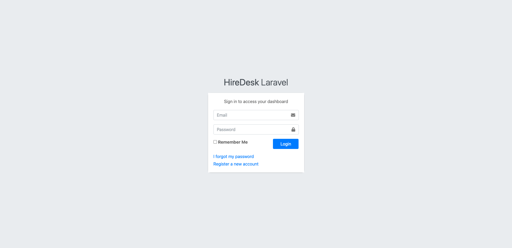

### Register

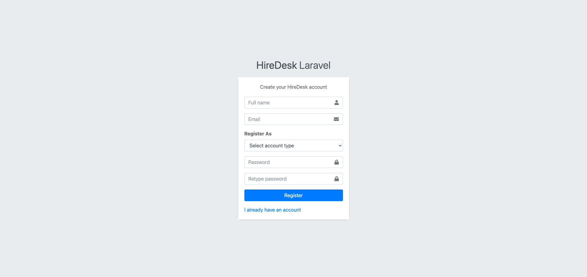

### Browse Jobs

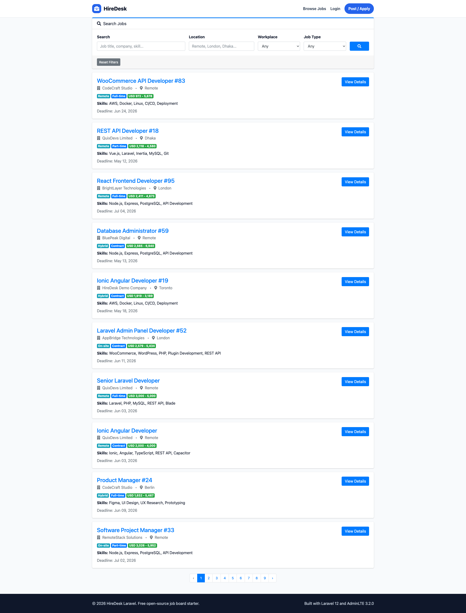

### Employer Dashboard

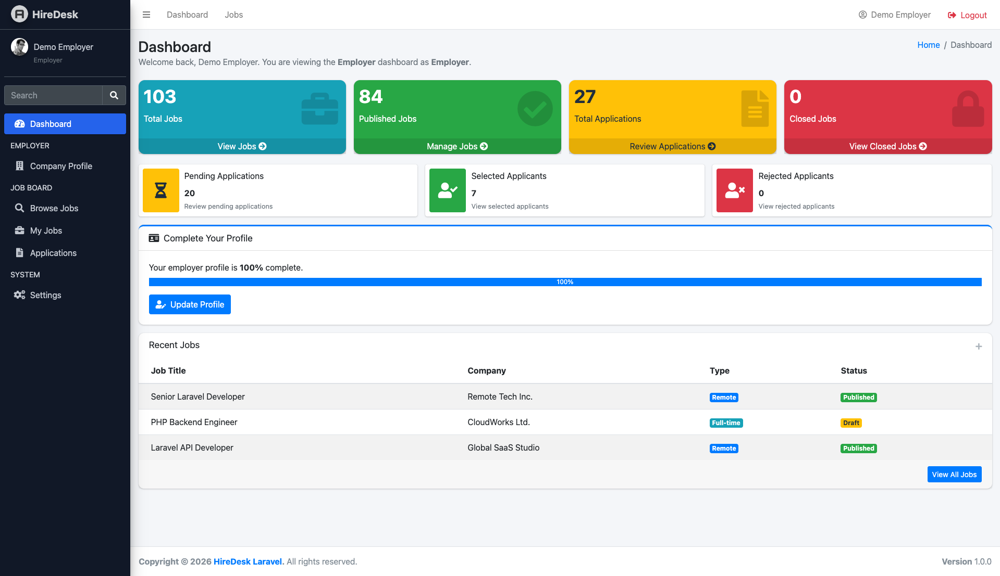

### Applicant Dashboard

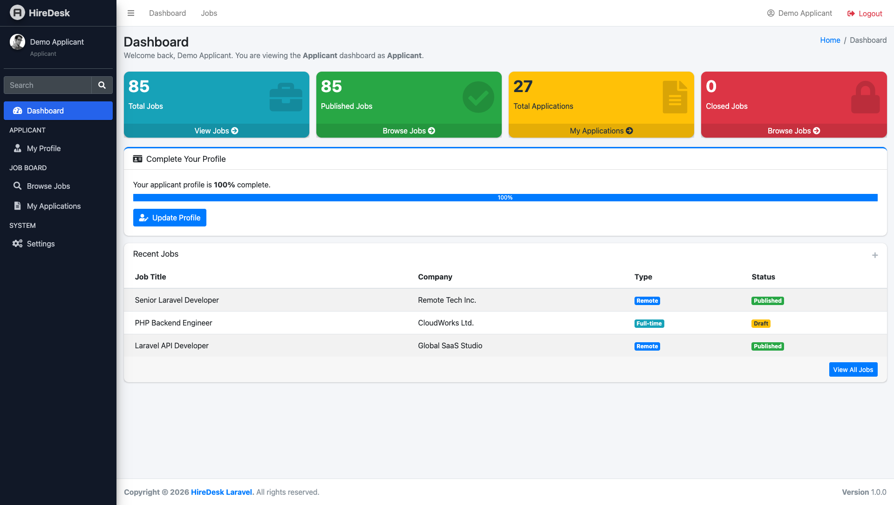

### Employer - My Jobs

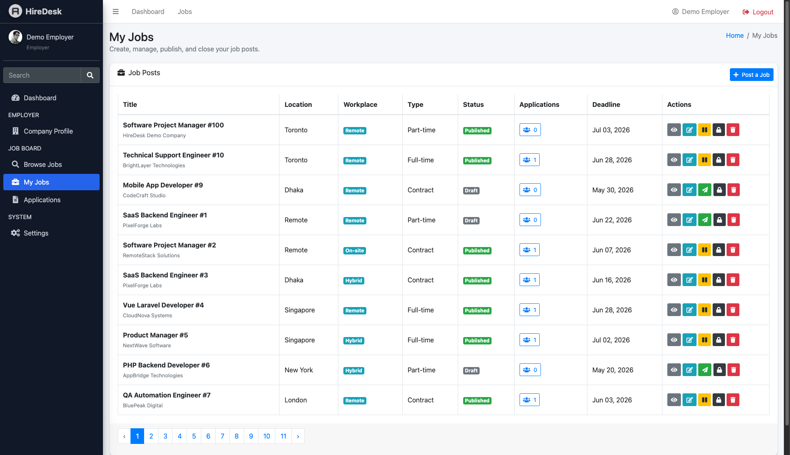

### Employer - Applications

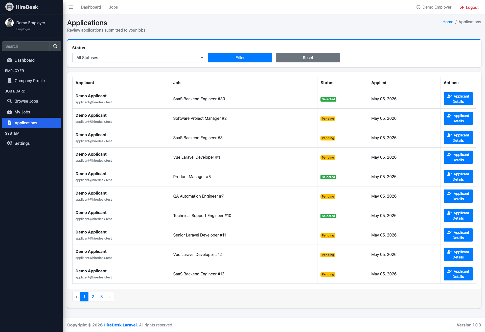

### Employer - Applicant Details

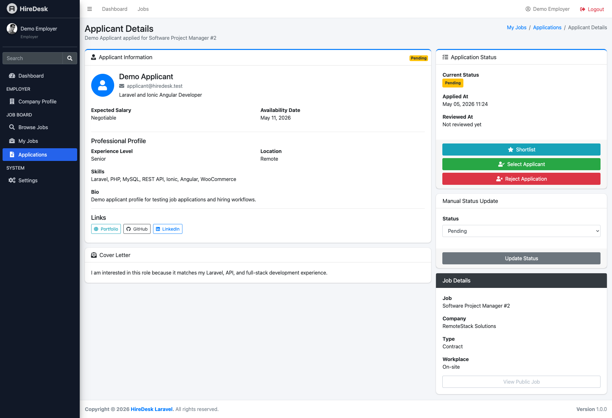

### Applicant Profile

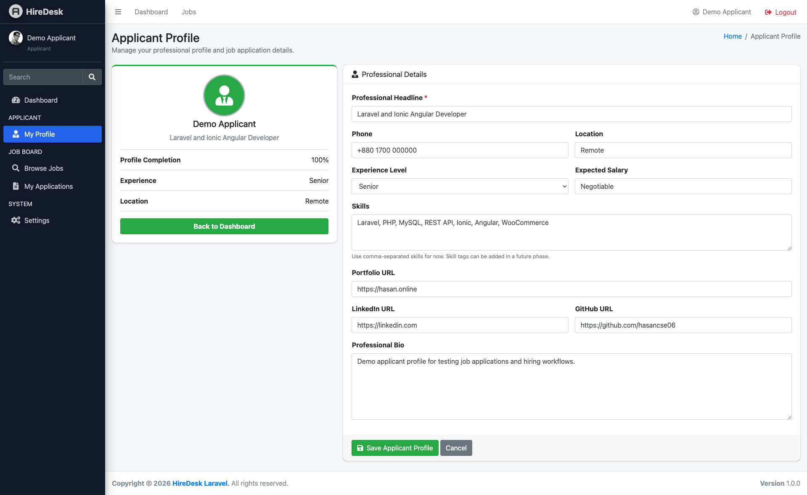

### Applicant - My Applications

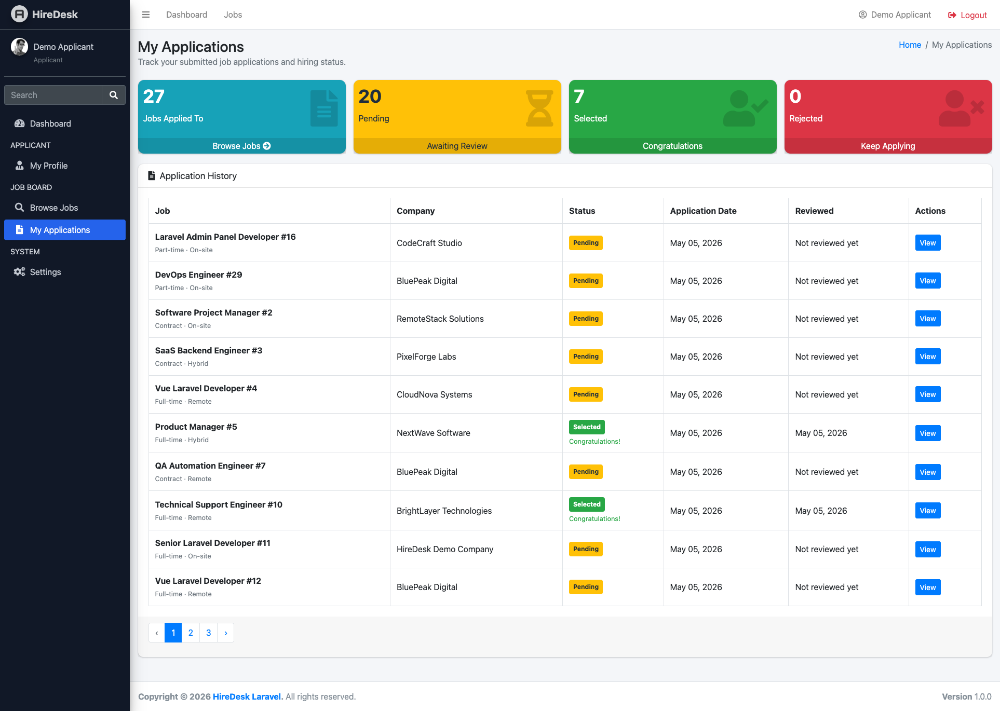

### Applicant - Application Details

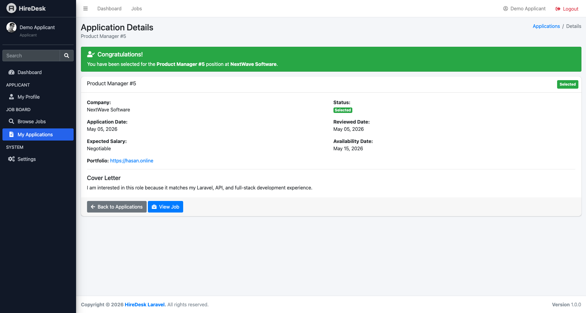

### Super Admin - Users

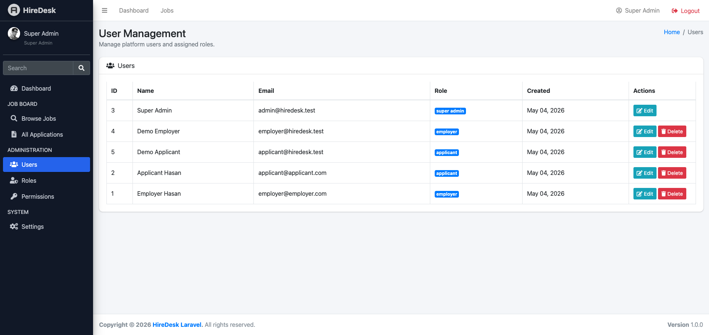

### Super Admin - Roles

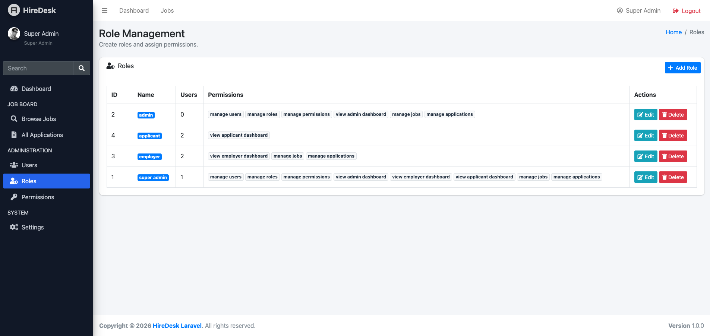

### Super Admin - Edit Role

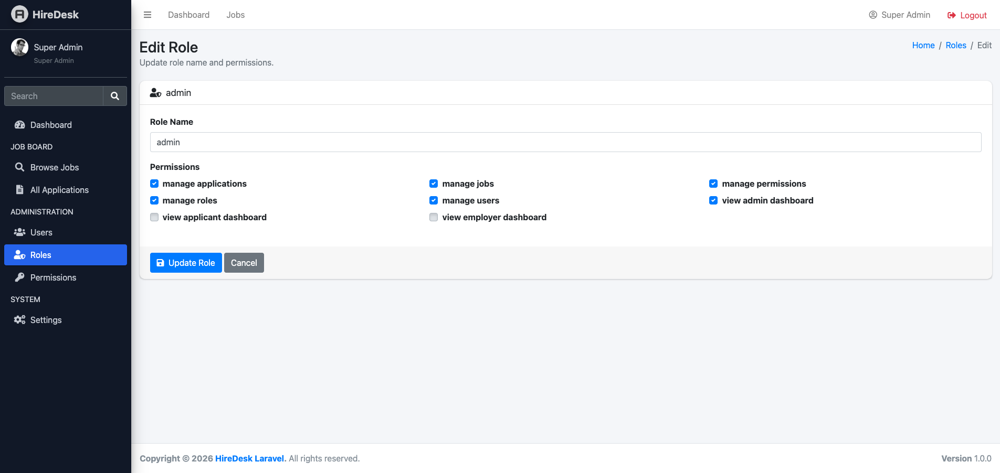

### Super Admin - Permissions

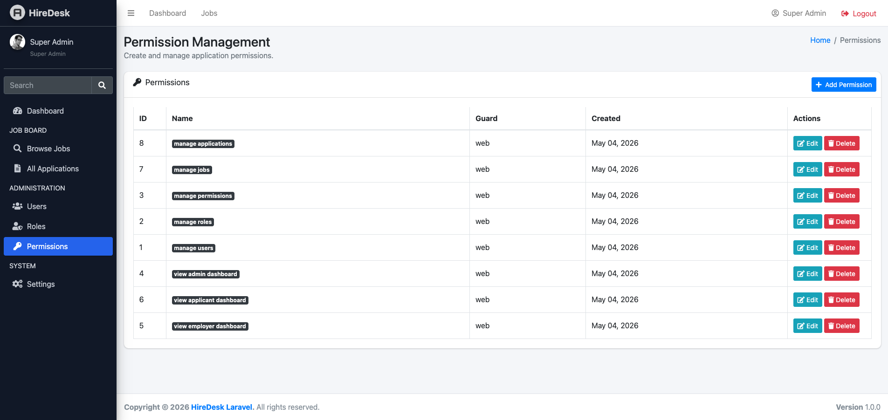
