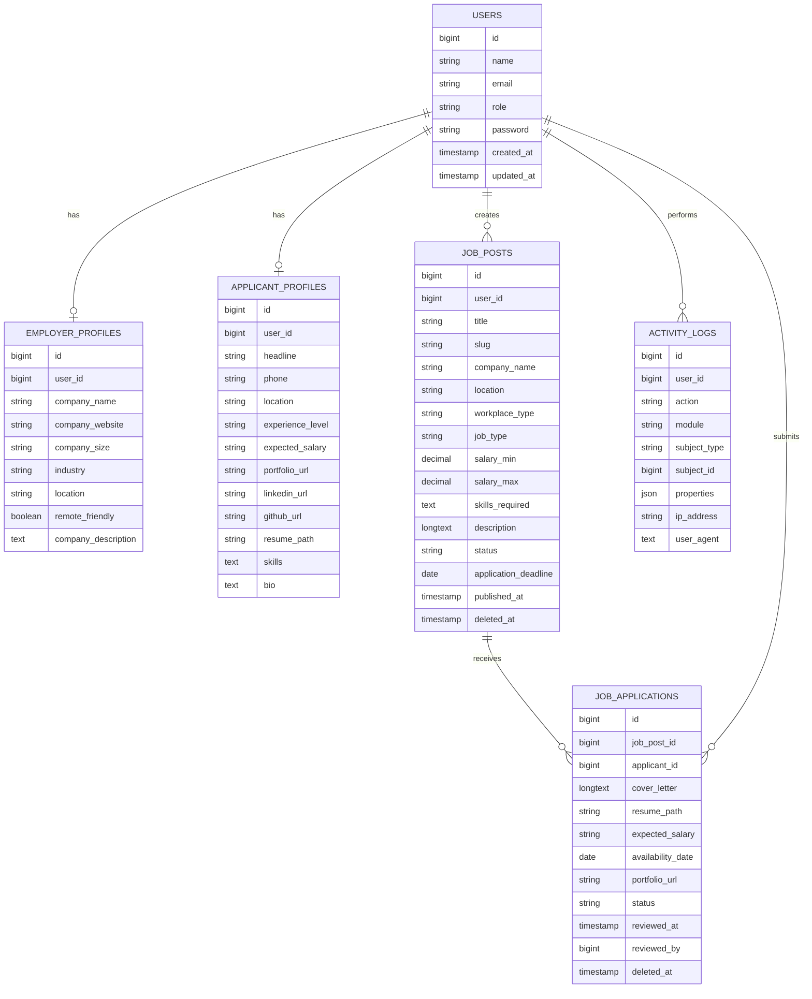

# HireDesk Laravel Database Schema

```mermaid
erDiagram
    USERS ||--o| EMPLOYER_PROFILES : has
    USERS ||--o| APPLICANT_PROFILES : has
    USERS ||--o{ JOB_POSTS : creates
    JOB_POSTS ||--o{ JOB_APPLICATIONS : receives
    USERS ||--o{ JOB_APPLICATIONS : submits
    USERS ||--o{ ACTIVITY_LOGS : performs

    USERS {
        bigint id
        string name
        string email
        string role
        string password
        timestamp created_at
        timestamp updated_at
    }

    EMPLOYER_PROFILES {
        bigint id
        bigint user_id
        string company_name
        string company_website
        string company_size
        string industry
        string location
        boolean remote_friendly
        text company_description
    }

    APPLICANT_PROFILES {
        bigint id
        bigint user_id
        string headline
        string phone
        string location
        string experience_level
        string expected_salary
        string portfolio_url
        string linkedin_url
        string github_url
        string resume_path
        text skills
        text bio
    }

    JOB_POSTS {
        bigint id
        bigint user_id
        string title
        string slug
        string company_name
        string location
        string workplace_type
        string job_type
        decimal salary_min
        decimal salary_max
        text skills_required
        longtext description
        string status
        date application_deadline
        timestamp published_at
        timestamp deleted_at
    }

    JOB_APPLICATIONS {
        bigint id
        bigint job_post_id
        bigint applicant_id
        longtext cover_letter
        string resume_path
        string expected_salary
        date availability_date
        string portfolio_url
        string status
        timestamp reviewed_at
        bigint reviewed_by
        timestamp deleted_at
    }

    ACTIVITY_LOGS {
        bigint id
        bigint user_id
        string action
        string module
        string subject_type
        bigint subject_id
        json properties
        string ip_address
        text user_agent
    }
```